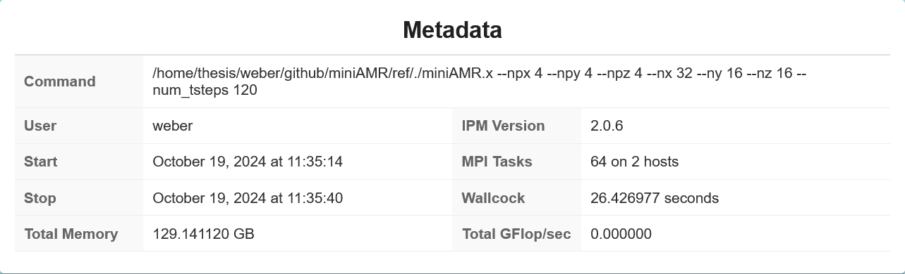
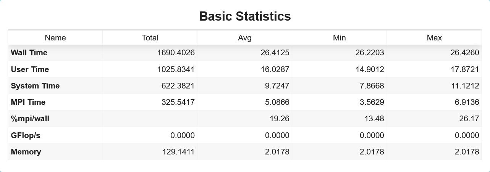
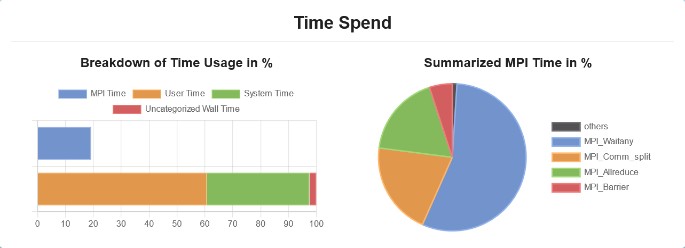
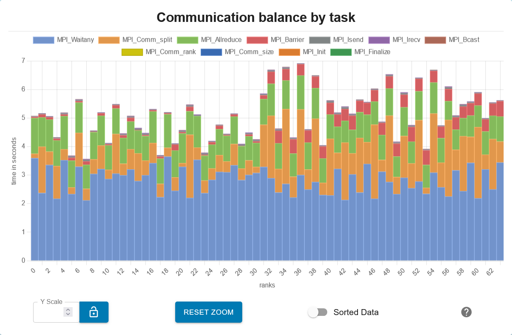
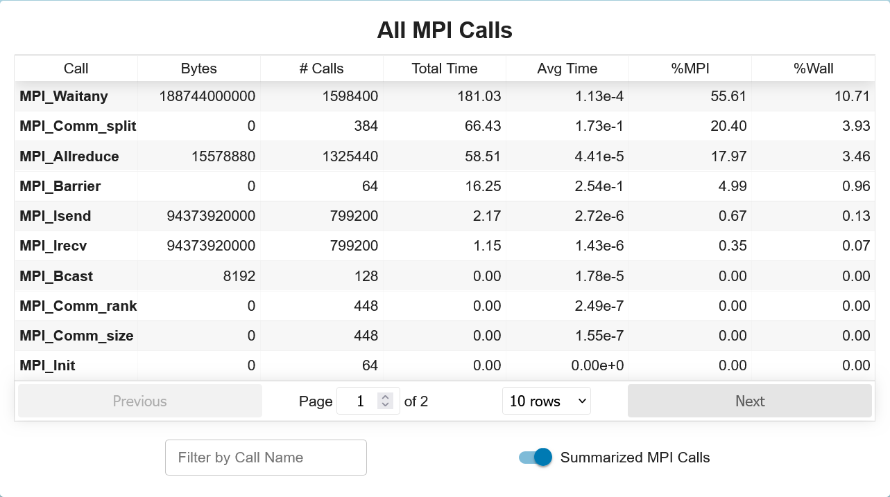
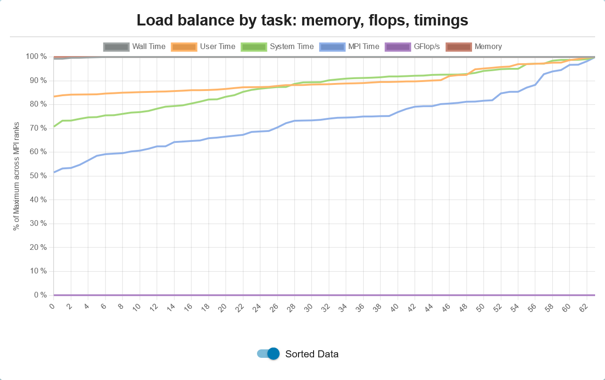
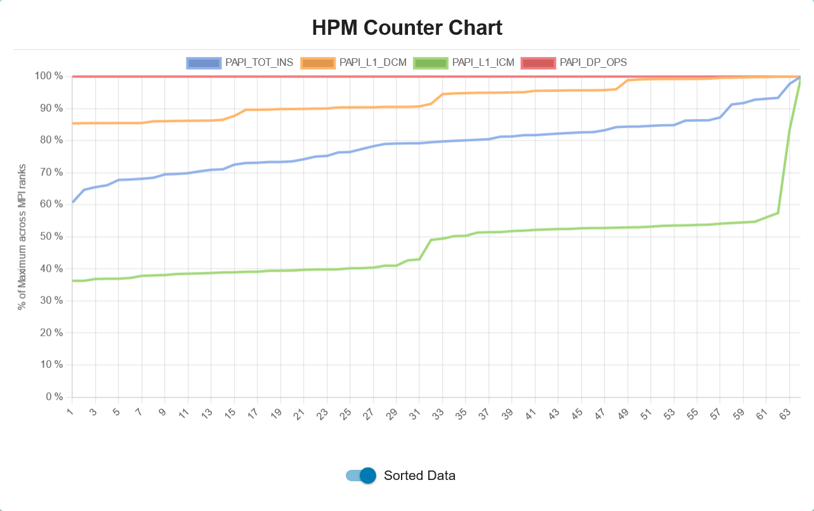
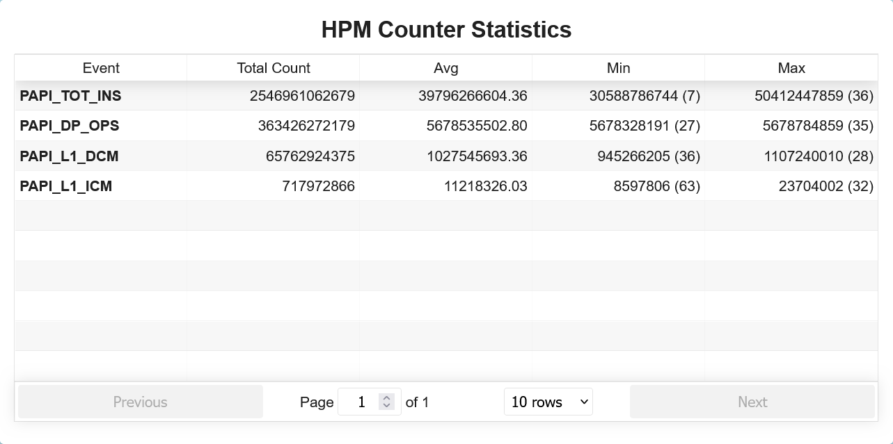
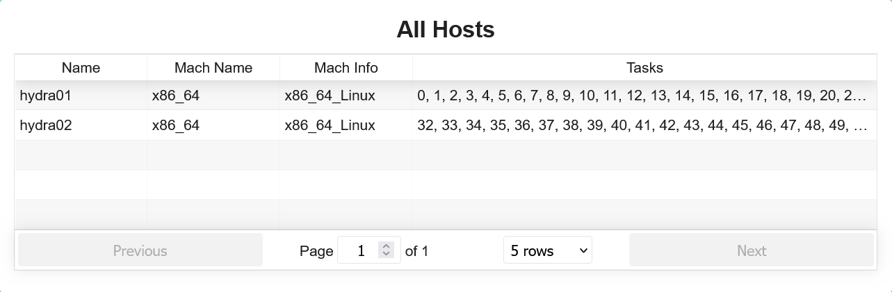

# IPM Profiler Visualizer

## Overview

A parser for data obtained by the IPM profiler, all inside your browser, and done 100% locally on your PC!

## Try it out here

Try the [IPM Visualizer](https://christoph-tu.github.io/IPM-visualizer/) or download the [HTML file](https://github.com/Christoph-TU/IPM-visualizer/tree/gh-pages) and open it with your favorite browser!

## Features

Like the Perl script, but better! We can also visualize profiled data without hash table entries. Try it out with examples in the `examples/` directory or bring your own! Tested with files up to 200 MB in size.

## Examples

### Setting Up the Development Environment

- **Dependency Installation:** Execute `npm install` within the project directory to install necessary dependencies.
- **Launching the Application:** Start the application in development mode with `npm start`, accessible via [http://localhost:1234](http://localhost:1234). The application supports live reloading for iterative development.
- **Production Build:** Use `npm run build` to compile and bundle the application for production, optimizing performance and efficiency.
- **Packaging for Release:** The `npm run package` command facilitates the creation of distributable packages, streamlining the deployment process.